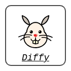

# Diffy
<br>
<p align="center">

</p>

<p align="center">
Diffy
</p>

## How to use

```go
package main

import (
	"fmt"
	"strings"

	"github.com/orangekame3/diffy"

	"github.com/kylelemons/godebug/diff"
)

func main() {
    a := strings.TrimSpace(`
    We the People of the United States, in Order to form a more perfect Union,
    establish Justice, insure domestic Tranquility, provide for the common defence,
    promote the general Welfare, and secure the Blessings of Liberty to ourselves
    and our Posterity, do ordain and establish this Constitution for the United
    States of America.
    `)

    b := strings.TrimSpace(`
    :wq
    We the People of the United States, in Order to form a more perfect Union,
    establish Justice, insure domestic Tranquility, provide for the common defence,
    and secure the Blessings of Liberty to ourselves
    and our Posterity, do ordain and establish this Constitution for the United
    States of America.
    `)

    aLines := strings.Split(a, "\n")
    bLines := strings.Split(b, "\n")
    chunks := diff.DiffChunks(aLines, bLines)
    lines := diffy.FormatWithLineNumber(chunks)
    for _, line := range lines {
        fmt.Println(line.Ope, line.NewLineNumber, line.OldLineNumber, line.Text)
    }
}
```

```shell
❯ go run main.go
@Delete -1 1 We the People of the United States, in Order to form a more perfect Union,
@Add 1 -1 :wq
@Add 2 -1 We the People of the United States, in Order to form a more perfect Union,
@Equal 3 2 establish Justice, insure domestic Tranquility, provide for the common defence,
@Delete -1 3 promote the general Welfare, and secure the Blessings of Liberty to ourselves
@Add 4 -1 and secure the Blessings of Liberty to ourselves
@Equal 5 4 and our Posterity, do ordain and establish this Constitution for the United
@Equal 6 5 States of America.
```
